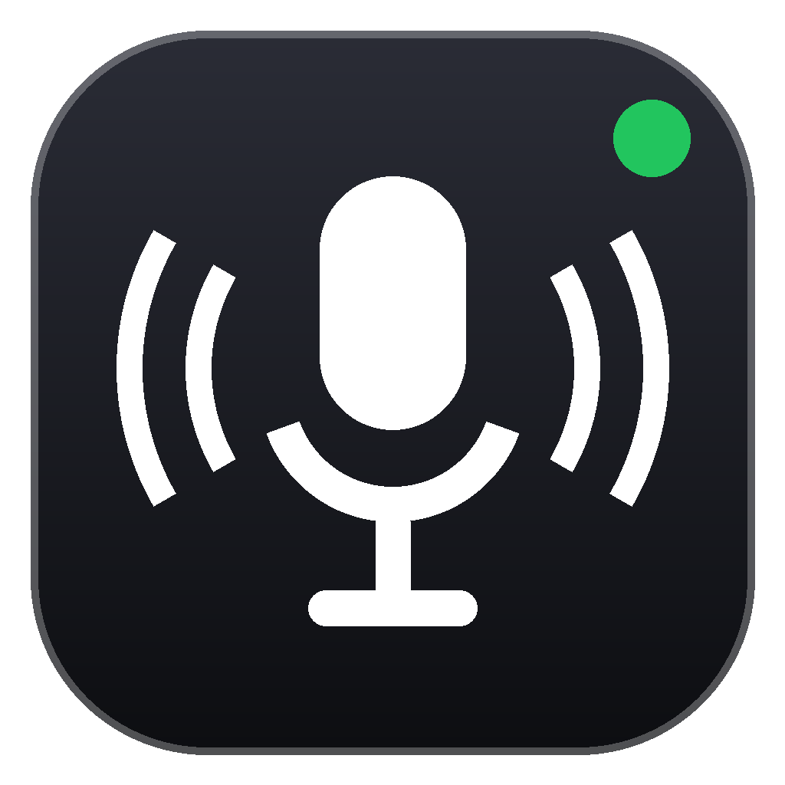

<div align="center">



# Asistemis

**Tu asistente de voz para Windows. Gratis, privado y 100 % en tu PC.**

Dile «*Asistemis, …*» y anota, abre tus apps y juegos, organiza tus tareas, pone música o le pasa el pedido a Claude.


[Qué hace](#-qué-puede-hacer) · [Comandos](#%EF%B8%8F-comandos-de-voz) · [Instalación](#-instalación) · [Preguntas](#-problemas-frecuentes)

</div>

---

```text
🎙️  «Asistemis, anota llamar al dentista el lunes… eso es todo»   →  📝 nota guardada con fecha
🎙️  «Asistemis, abrime visual studio code»                        →  🚀 se abre (o aparece si ya estaba abierta)
🎙️  «Asistemis, agregá la tarea terminar el informe»              →  ✅ tarea #4 en Pendientes
🎙️  «Asistemis, reproducime música»                               →  🎵 YouTube Music empieza a sonar
```

## ✨ ¿Por qué Asistemis?

| | |
|---|---|
| 🔒 **Privado** | Tu voz se convierte en texto **dentro de tu computadora** con [Whisper](https://github.com/SYSTRAN/faster-whisper). No se envía audio a ningún servidor. |
| 💸 **Gratis** | Anotar, abrir, cerrar, buscar, tareas y música no cuestan nada. Claude es opcional. |
| ⚡ **Rápido** | Con una tarjeta NVIDIA entiende lo que dices en ~0,3 segundos. |
| 🎛️ **Siempre a mano** | Un solo atajo (**Ctrl+Alt+N**) lo enciende y lo apaga. Asígnalo a un botón del mouse y listo. |
| 🪟 **Hecho para Windows 11** | Interfaz con efecto de cristal, icono junto al reloj y arranque automático con Windows. |

## 🧭 Cómo se usa, en 3 pasos

1. **Enciéndelo** con **Ctrl+Alt+N**. Aparece el aviso «Asistemis encendido» y una burbuja con un micrófono al costado de la pantalla.
2. **Háblale** empezando siempre por su nombre: «*Asistemis, …*».
3. **Listo.** Las órdenes se hacen en cuanto haces una pausa. Las notas terminan cuando dices «*eso es todo*».

Cuando no lo necesites, vuelve a pulsar **Ctrl+Alt+N**: el micrófono se cierra y deja de consumir recursos.

## 🚀 Qué puede hacer

| | Función | En pocas palabras |
|:-:|---|---|
| 📝 | **Notas por voz** | Dictas y se guardan con fecha y hora. Las ves como un chat en la ventana de Asistemis. |
| 🚀 | **Abrir apps y juegos** | Cualquier app del menú Inicio y tu biblioteca de Steam. Si ya está abierta, la trae al frente. |
| ❌ | **Cerrar apps** | Como pulsar la ✕ de la ventana. |
| 🔎 | **Buscar en internet** | Abre la búsqueda de Google en tu navegador. |
| ✅ | **Tareas** | Un tablero con *Pendientes*, *En progreso* y *Finalizadas* que manejas con la voz o con el mouse. |
| 🎵 | **Música** | Abre YouTube Music y le da play. |
| 🤖 | **Claude** *(opcional)* | Lo que requiere pensar (resumir, redactar, investigar) se lo pasa a Claude. |

## 🗣️ Comandos de voz

> Empieza siempre con **«Asistemis, …»**. No hace falta hablar como un robot: «abrí», «abrime», «iniciá» y «lanzá» funcionan igual.

### 📝 Notas

| Dices | Qué pasa |
|---|---|
| «Asistemis, **anota** comprar pan… **eso es todo**» | Guarda «comprar pan» con la fecha. |
| «Asistemis, **apunta** …» | Lo mismo que *anota*. |

La nota termina cuando dices «**eso es todo**» o «**eso sería todo**», o tras **15 segundos** de silencio.

### 🚀 Apps, juegos e internet

| Dices | Qué pasa |
|---|---|
| «Asistemis, **abrime** Chrome» | Abre Chrome o lo trae al frente si ya estaba abierto. |
| «Asistemis, **iniciá** / **arrancá** / **lanzá** Discord» | Igual que *abrime*. |
| «Asistemis, **jugá** al God of War» | Abre el juego (también los de Steam). |
| «Asistemis, **ejecutá** Steam» | Si es una app, la abre sin gastar nada de Claude. |
| «Asistemis, **cerrá** / **cerrame** Chrome» | Cierra sus ventanas. |
| «Asistemis, **busca** recetas de pizza» | Abre la búsqueda en tu navegador. |

### ✅ Tareas

Cada tarea recibe un número (#1, #2, #3…) para que puedas nombrarla.

| Dices | Qué pasa |
|---|---|
| «Asistemis, **agregá la tarea** terminar el informe» | La crea en **Pendientes**. También vale «nueva tarea …». |
| «Asistemis, **estoy haciendo** la tarea 3» | La pasa a **En progreso**. También: «empecé», «estoy trabajando en». |
| «Asistemis, **terminé** la tarea 3» | La pasa a **Finalizadas**. También: «finalicé», «completé». |
| «Asistemis, **marcá la tarea 3 como pendiente**» | La devuelve a **Pendientes**. |
| «Asistemis, **borrá** la tarea 3» | La elimina. |

El número puedes decirlo como quieras: «tarea 3», «tarea tres» o «tarea número tres».

### 🎵 Música

| Dices | Qué pasa |
|---|---|
| «Asistemis, **reproducime música**» | Abre YouTube Music y pone la canción. Si ya estaba abierta, le da play. |
| «Asistemis, **quiero escuchar música**» / «**poné** música» | Lo mismo. |

> Necesita la app de **YouTube Music** instalada (en Chrome o Edge: abre music.youtube.com → menú ⋮ → *Instalar*).

### 🤖 Claude *(opcional)*

| Dices | Qué pasa |
|---|---|
| «Asistemis, **ejecutá** resumime las notas de hoy» | Como no es una app, se lo pasa a Claude. La respuesta aparece en su panel. |

## ⌨️ Atajos y menú

| Atajo | Qué hace |
|---|---|
| **Ctrl+Alt+N** | Enciende / apaga Asistemis. |
| **Ctrl+Alt+C** | Abre el panel de Claude para escribirle. |
| **Doble clic** en el icono junto al reloj | Abre la ventana de Asistemis. |
| **Clic derecho** en el icono | Encender/apagar, *Anotar ahora* (sin decir «Asistemis»), Claude, archivo de notas y *Salir*. |

> 💡 **Consejo:** asigna **Ctrl+Alt+N** a un botón lateral del mouse (en Logitech: *Logi Options+ → botón → Atajo de teclado*).

## 🪟 La ventana de Asistemis

Se abre desde el menú Inicio, con doble clic en el icono junto al reloj o abriendo Asistemis otra vez. Cerrarla **no** apaga Asistemis: sigue en segundo plano.

- **Notas:** tus notas como un chat, agrupadas por día y con buscador. Puedes escribir notas nuevas, copiarlas, borrarlas o convertirlas en tarea con **→ Tarea**. También muestra lo que abriste, cerraste y buscaste (se puede ocultar).
- **Tareas:** tablero de 3 columnas. Agrega tareas escribiendo y muévelas arrastrándolas o con las flechas de cada tarjeta.
- **Claude:** el mismo chat que el panel de Ctrl+Alt+C.
- **Interruptor** para encender y apagar sin usar el teclado.

## 📋 Requisitos

| | Necesario | Detalle |
|---|:-:|---|
| 💻 **Windows 11** | ✅ | El efecto de cristal es de Windows 11. En Windows 10 no está probado. |
| 🐍 **Python 3.10, 3.11 o 3.12** | ✅ | Probado con 3.12. Se instala con `winget install Python.Python.3.12`. |
| 🎤 **Micrófono** | ✅ | Cualquiera sirve. Con auriculares funciona mejor. |
| 💾 **Espacio libre** | ✅ | ~2 GB para los modelos de voz, más ~1,5 GB si tienes tarjeta NVIDIA. |
| 🌐 **Internet** | ✅ | Solo la primera vez, para descargar los modelos de voz. Después funciona sin conexión. |
| 🎮 **Tarjeta NVIDIA** | ➖ | Opcional pero recomendada: responde en ~0,3 s. Sin ella usa el procesador y tarda unos segundos. |
| 🤖 **Claude Code** | ➖ | Opcional. Solo para las órdenes con «ejecutá» que no son una app. |

## 📦 Instalación

**1. Descarga Asistemis**

Botón verde **Code → Download ZIP** y descomprímelo, o con git:

```powershell
git clone https://github.com/AzzADesigns/Asistemis.git
```

Déjalo en una carpeta fija (por ejemplo `C:\Users\<tu-usuario>\Asistemis`): los accesos directos apuntan ahí.

**2. Haz doble clic en `instalar.cmd`**

El instalador lo hace todo solo:

- ✔ prepara un entorno de Python propio e instala lo necesario,
- ✔ si tienes tarjeta NVIDIA, instala lo que hace falta para usarla,
- ✔ descarga los modelos de voz (~1,6 GB, solo la primera vez),
- ✔ crea el acceso en el menú Inicio y hace que arranque con Windows,
- ✔ y abre Asistemis.

**3. ¡Listo!**

Verás el aviso **«Asistemis encendido»** y un icono junto al reloj. Prueba: «*Asistemis, anota hola mundo… eso es todo*».

> ⚠️ Si Windows avisa que el archivo puede ser peligroso, es porque es un script descargado de internet y sin firma. Puedes abrir `instalar.ps1` con el Bloc de notas para ver exactamente qué hace antes de aceptar.

<details>
<summary><b>Opciones avanzadas del instalador</b></summary>

Desde PowerShell, dentro de la carpeta de Asistemis:

```powershell
.\instalar.ps1 -SinInicioAutomatico   # no arrancar con Windows
.\instalar.ps1 -SinDescargarModelos   # los modelos se descargan al abrirlo la primera vez
.\instalar.ps1 -SinAccesos            # sin accesos directos (instalación portátil)
.\instalar.ps1 -NoAbrir               # no abrir Asistemis al terminar
```

</details>

### 🤖 Activar Claude (opcional)

1. Instala [Claude Code](https://claude.com/claude-code).
2. Abre una terminal, escribe `claude` e inicia sesión con tu cuenta.
3. Reinicia Asistemis (icono junto al reloj → *Salir*, y ábrelo desde el menú Inicio).

Sin Claude, todo lo demás funciona igual.

**¿Cuánto consume?** Anotar, abrir, cerrar, buscar, tareas y música **no usan Claude (0 tokens)**. Solo consumen de tu plan las órdenes con «ejecutá» que no son una app y lo que escribas en su panel. Cada orden es un chat nuevo y Claude trabaja con permisos mínimos: puede leer y buscar archivos, buscar en la web, abrir apps y anotar, pero **no** puede borrar, modificar ni instalar nada (ver `claude/CLAUDE.md`).

## 🔒 Tus datos

Todo lo tuyo está en **`%LOCALAPPDATA%\Asistemis`** (`Win+R` → pega esa ruta → Enter), separado del programa:

| Archivo | Qué guarda |
|---|---|
| `notas.txt` | Tus notas, una por línea, con fecha. |
| `tareas.json` | Tus tareas. |
| `ajustes.json` | Tus preferencias. |
| `models\` | Los modelos de voz. |
| `asistemis.log` | Registro técnico, útil si algo falla. |

Por privacidad, Asistemis **no guarda lo que oye**. Si quieres ajustar la activación, pon `"registrar_lo_oido": true` en `ajustes.json`: guardará en el registro lo que entiende y el audio de la última nota.

## 🛠️ Personalizar

| Quiero cambiar… | Dónde |
|---|---|
| Cómo arranca (encendido o apagado) | Se recuerda solo: arranca como lo dejaste. |
| Nombres de apps que entiende mal | `ALIASES`, `ALIAS_PATTERNS` y `HOTWORDS` en `herramientas.py` |
| Palabra de activación y tiempos de espera | Constantes al principio de `asistemis.py` |
| Cómo responde Claude | `claude/CLAUDE.md` |

## ❓ Problemas frecuentes

> 📖 **Guía completa de bloqueos de Windows** (Smart App Control, antivirus, PyAV/ffmpeg):  
> **[docs/bloqueos-windows.md](docs/bloqueos-windows.md)** — incluye cómo usar Asistemis **sin desactivar el antivirus** (§5).

<details>
<summary><b>«DLL load failed … Control de aplicaciones bloqueó este archivo»</b></summary>

Windows 11 **Smart App Control** (en español: **Control Inteligente de Aplicaciones**) bloquea los DLL de PyAV/ffmpeg (los usa Whisper). Se ve en el instalador o al abrir Asistemis, sobre todo al descargar los modelos. También salta una notificación de Seguridad de Windows: *«Parte de esta aplicación se ha bloqueado… no podemos confirmar quién publicó avformat-….dll»*.

**Ruta en Windows en español** (no es el antivirus; Defender puede seguir activo):

1. **Win + I** → **Privacidad y seguridad** → **Seguridad de Windows**
2. **Control de aplicaciones y navegadores**
3. **Configuración de control de aplicaciones inteligentes**  
   (puede aparecer como *Smart App Control*)
4. **Desactivar**
5. Terminal nueva y verificar:  
   `.venv\Scripts\python.exe -c "import av; print(av.__version__)"`
6. Volvé a ejecutar `instalar.cmd` (o abrí Asistemis para que baje los modelos).

Guía completa (registro, antivirus, Sandbox): **[docs/bloqueos-windows.md](docs/bloqueos-windows.md)**.

</details>

<details>
<summary><b>El instalador dice que no encuentra Python 3.10–3.12</b></summary>

Puede pasar aunque `winget install Python.Python.3.12` ya se haya ejecutado:

1. **El lanzador `py` no ve 3.12 en ese contexto.** En PowerShell 5.1, el script pasaba los argumentos con splatting de string (`@args` con `"-3.12"`); eso enumera caracteres y el instalador fallaba aunque Python estuviera bien. La detección ahora usa array (`@($args)`) y, si hace falta, busca `%LOCALAPPDATA%\Programs\Python\Python312\python.exe`.
2. **Cerrá y abrí la terminal** después de instalar Python: el PATH se actualiza en una sesión nueva.
3. Verificá a mano: `py -3.12 --version` o el `python.exe` de la carpeta `Python312`.
4. Si sigue fallando: `winget install Python.Python.3.12` y volvé a correr `instalar.cmd`.

</details>

<details>
<summary><b>No me entiende cuando digo «Asistemis»</b></summary>

Acércate al micrófono y revisa que Windows use el correcto: *Configuración → Sistema → Sonido → Entrada*. Con `"registrar_lo_oido": true` en `ajustes.json` verás en `asistemis.log` qué está entendiendo.
</details>

<details>
<summary><b>Ctrl+Alt+N no hace nada</b></summary>

Probablemente otro programa ya usa ese atajo. El archivo `asistemis.log` lo indica.
</details>

<details>
<summary><b>La primera vez tarda mucho en arrancar</b></summary>

Está descargando los modelos de voz (~1,6 GB). Pasa una sola vez.
</details>

<details>
<summary><b>No abre una app que tengo instalada</b></summary>

Asistemis solo abre lo que aparece en el menú Inicio o en tu biblioteca de Steam, y nunca desinstaladores ni herramientas del sistema. Si Whisper entiende mal el nombre, agrégalo en `ALIASES` dentro de `herramientas.py`.
</details>

<details>
<summary><b>«Reproducime música» no hace nada</b></summary>

Instala YouTube Music como app desde Chrome o Edge (music.youtube.com → menú ⋮ → *Instalar*).
</details>

<details>
<summary><b>Las órdenes para Claude dan error</b></summary>

Comprueba que `claude` funcione en una terminal y que hayas iniciado sesión.
</details>

## 🗑️ Desinstalar

1. Icono junto al reloj → **Salir**.
2. Borra la carpeta del programa (la que descargaste, o `%LOCALAPPDATA%\Programs\Asistemis` si usaste el .exe).
3. Borra los accesos `Asistemis.lnk` del menú Inicio y de la carpeta de inicio (`Win+R` → `shell:startup`).
4. Si ya no quieres tus notas ni los modelos de voz, borra `%LOCALAPPDATA%\Asistemis`. **Copia antes `notas.txt` y `tareas.json` si quieres conservarlos.**

---

<details>
<summary><b>👩‍💻 Para desarrolladores</b></summary>

### Compilar como .exe

```powershell
powershell -ExecutionPolicy Bypass -File compilar.ps1            # crea dist\Asistemis\Asistemis.exe
powershell -ExecutionPolicy Bypass -File compilar.ps1 -Instalar  # y lo instala en %LOCALAPPDATA%\Programs\Asistemis
```

Requiere haber ejecutado antes `instalar.cmd`. El resultado es una carpeta con `Asistemis.exe` y `herramientas.exe` (la usa Claude) que no necesita Python. Pesa ~2,3 GB con las librerías de NVIDIA. Los modelos de voz se descargan aparte la primera vez.

### Cómo está hecho

| Archivo | Qué hace |
|---|---|
| `asistemis.py` | Micrófono, detección de «Asistemis», transcripción con Whisper y qué hacer con lo dicho |
| `herramientas.py` | Abrir y cerrar apps, Steam, búsquedas, música, notas y tareas (también lo usa Claude) |
| `ordenes.py` | Conexión con Claude Code (`claude -p`) |
| `interfaz.py`, `ui/` | Interfaz en HTML/CSS con pywebview y el cristal de Windows 11 |
| `claude/` | Carpeta de trabajo de Claude: instrucciones y comandos permitidos |
| `recursos/` | Icono y datos de versión del .exe |
| `instalar.cmd`, `instalar.ps1` | Instalador desde el código |
| `asistemis.spec`, `compilar.ps1` | Receta y script para compilar el .exe con PyInstaller |

</details>

<div align="center">
<sub>Hecho con 🎙️ y Whisper · Funciona en tu PC, no en la nube</sub>
</div>
